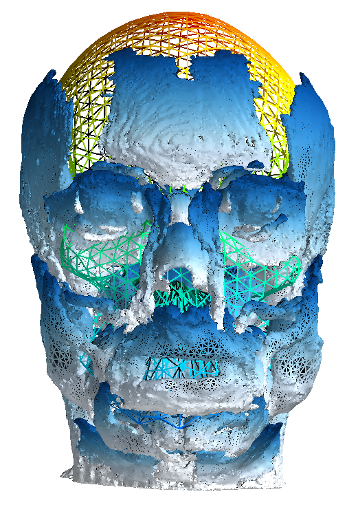

# HArtMuT (Head Artefact Model using Tripoles)
**Supplementary material to the scientific publication (currently in submission)** 

### Who is this HArtMuT?
Correctly localizing and identifying ICA patterns as brain or non-brain sources relies on head models 
that so far only take brain sources into account. 
We developed the Head Artefact Model using Tripoles (HArtMuT), a volume
conduction head model, that includes, besides brain sources, eyes and muscles
that can be modeled as single dipoles, symmetrical dipoles, and tripoles. 
We compared HArtMuT with the EEGLAB standard head model on their localization
accuracy and residual variance (RV) using firstly, a Finite Element Model (FEM)
as ground truth, and secondly, real-world data of mobile participants, and
found that HArtMuT improves localization for all sources, especially
non-brain. 

For more details, feel free to visit [https://www.hartmut.berlin](https://hartmut.neuro.tu-berlin.de/).

### What can I find here?
## [`HArtMuTmodels`](HArtMuTmodels) 
The final HArtMuT (BEM- and FEM-models) including cortical and artefactual sourcemodels, leadfields and labels.

## [`individualwarp`](individualwarp) 
Artefact model warping for individual head geometries.

